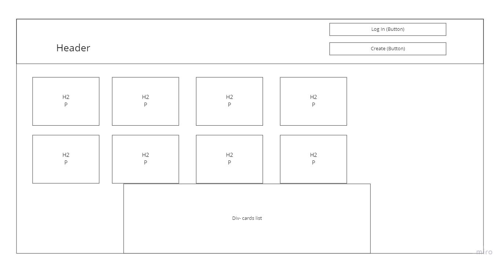
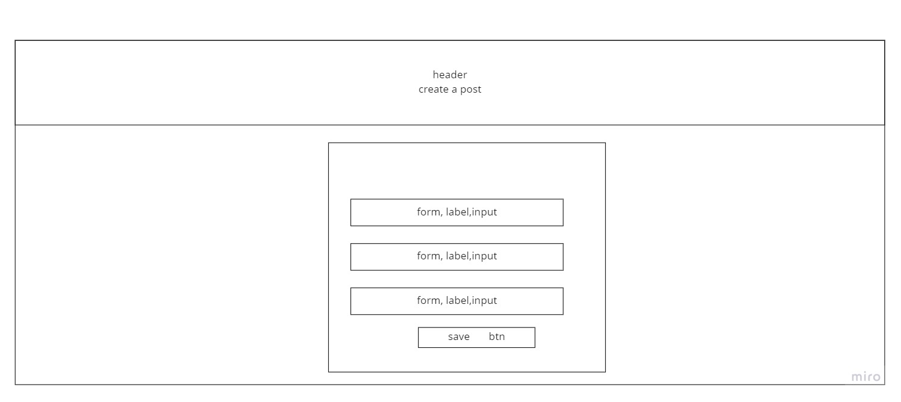
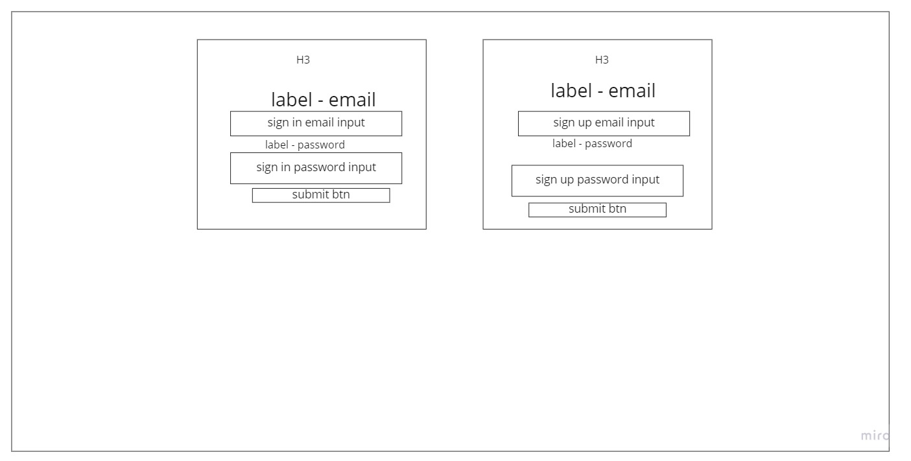

# README

## Events

Supabase table

1. Id
2. Title
3. Description
4. Contact

Home

1. Login button (click)-> redirect to auth page
2. Create button (click)-> redirect to create page
3. Display on load
    1. Fetch posts
        1. Title
        2. Description
        3. Contact
    2. Loop through the array of posts for render
    3. Render cards
        1. Div
        2. h3
        3. p
        4. p
        5. append h3, p, p to the Div
    4. Append to div list
    5. displayPosts()

Create Post

1. nvm
2. event listener for each form (submit)
3. Update supabase with new info
4. header button (click) redirect to home
5. redirect to home on form submit

Auth page

1. 4 forms (submit)
2. async signInUser
3. async signUpUser
